#Requirements Specification

## Version Information

| Version Number | Updated Time |  Operator  |       Remarks       |
| :----: | :------: | :------: | :---------------: |
|  v1.0  |   8/8    | Crew |   Requirements Document    |

## 1. Introduction

### 1.1 Purpose

&nbsp; &nbsp; This document describes the functional and non-functional requirements of "FOF-RoboAdviser——Intelligent Fund Investment System Based On Machine Learning". The implementation and verification of the software system made by the development team are based on this document.

### 1.2 Range

&nbsp; &nbsp; "FOF-RoboAdviser——Intelligent Fund Investment System Based On Machine Learning" is a system developed for fund investors. The goal of the development is to help investors deal with the main business of fund purchase, including fund portfolio recommendation (key point), fund purchase, fund redemption and fund information review.

&nbsp; &nbsp; Through the application of "FOF-RoboAdviser——Intelligent Fund Investment System Based On Machine Learning",  it is expected to recommend the most suitable fund portfolio for investors to achieve the greatest income and facilitate the purchase and redemption of investors.

### 1.3 Reference

1. Ding Eryu, Liu Qin. Computing and Software Engineering (Volume 2) \[M\] Machinery Industry Press, 2012: 134-182

## 2. General Description

### 2.1 Business Requirements

BR1: After 2 months of system investment, the user satisfaction will have reached 70%.

BR2: After 2 months of system investment, the total amount of user transactions will have reached 40000-50000.

### 2.2 Project function

SF1: Recommend available funds and provide their details to users . 

SF2: Determine the user's investment preference based on the user's questionnaire content and purchase record, and recommend the optimal fund combination for the user.

SF3: Help users complete the fund purchase and redemption operations. 

SF4: Provide users with details of income of funds currently held.

SF5: Adjust the fund portfolio according to market changes.

SF6: Master the usage of user login and manage the user permissions.

SF7: Master administrators' changes and authorizations. 

### 2.3 User Characteristics

|  User  | Characteristics  |
| :----: | :---: |
| Investors | The entire system is geared toward a large number of fund investors who use the system to obtain information on available funds and get recommendations for optimal fund portfolios. Through the system, they will choose the fund they want to buy, obtain the optimal fund portfolio, input the investment amount, and finally use the payment method provided by the system to purchase or redeem the fund. They can also monitor the income of purchased funds in real time through the system. At the same time, their computer operation skills are inconsistent. They may be in the process of misoperation due to unfamiliarity with the system. I hope the system can help them avoid these problems as much as possible. |
| Administrator | There are 1 or more administrators for the entire system. They need to add, delete, and change the fund portfolio when the fund portfolio changes. They need to master the information of user login, prohibit users from malicious login, and freeze the improper operation of the account. |
| The Main Administrator | The entire system has a main administrator, his job is to deal with changes in the administrator's information, add, delete, and change the administrator |

### 2.4 Constraint

CON1: The system uses a graphical interface

CON2: The system client runs on a WIN XP/7/8/10 or macOS or Android or IOS operating system browser, and the server runs on the Linux operating system.

CON3 : Projects are developed using a continuous integration approach

CON4: In development, developers are required to submit software requirements specification documents, test documentation, and user manuals.

### 2.5 Hypothesis and dependence

AE1: System users have certain computer operating capabilities

## 3 Description of detailed requirements

### 3.1 External interface requirements

#### 3.1.1 User interface

##### UI1 login

##### UI2 registe

##### UI3 fill questionnaire

New users go directly to the questionnaire interface, and can't access other pages. After submitting the questionnaire, they will jump to the `new user homepage`.

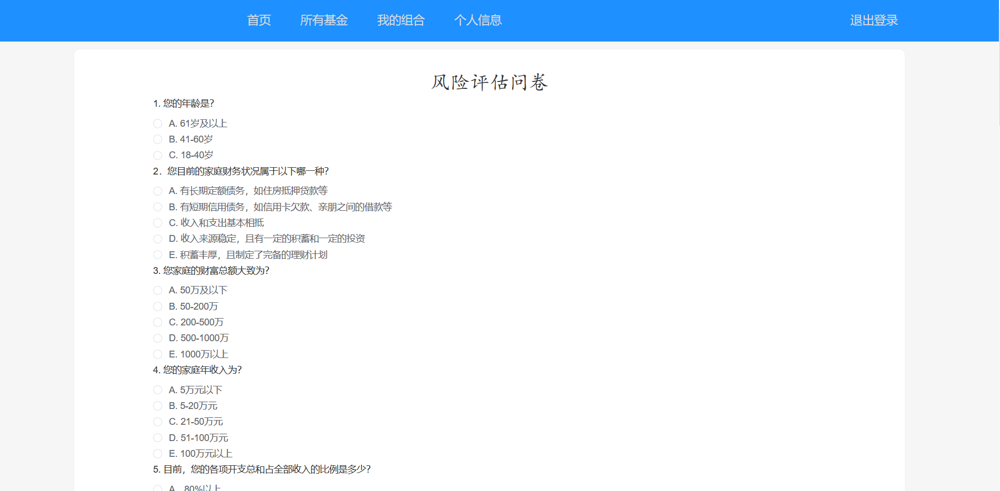

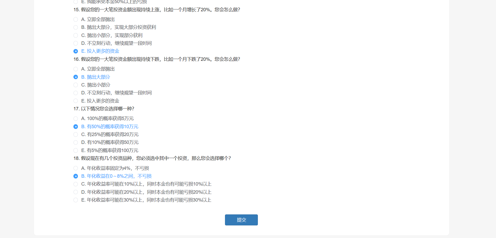

##### UI4 new user homepage

In the new user home page can see the three recommended combinations we offer, click on `查看详情` to jump to the `Fund Combination Details Screen`.

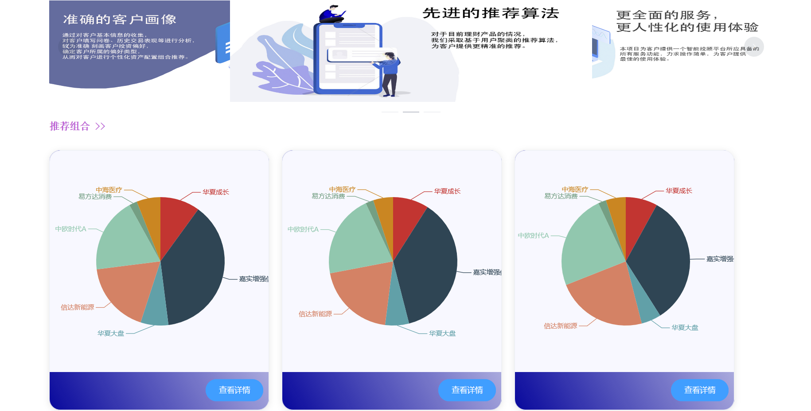

##### UI5 Regular customer homepage

The rugular user homepage will display about ten funds that we carefully recommend for each old user based on the algorithm calculation results.

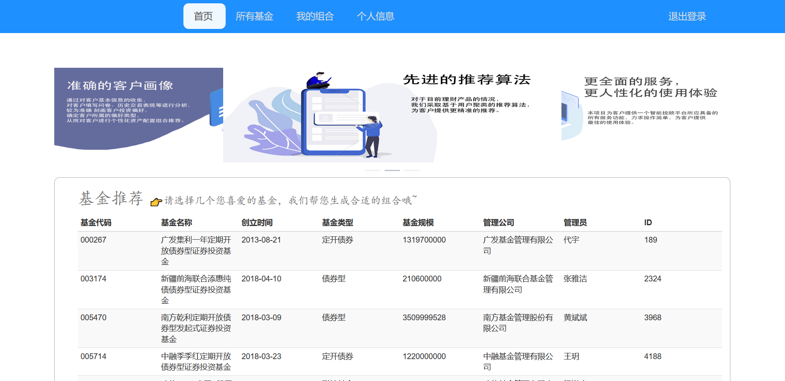

##### UI6 Regular customers select recommended funds page

The user arbitrarily selects several funds of interest, and after confirming, jumps to the `fund composition details page`, and can see the investment ratio of each fund that we generate through our algorithm

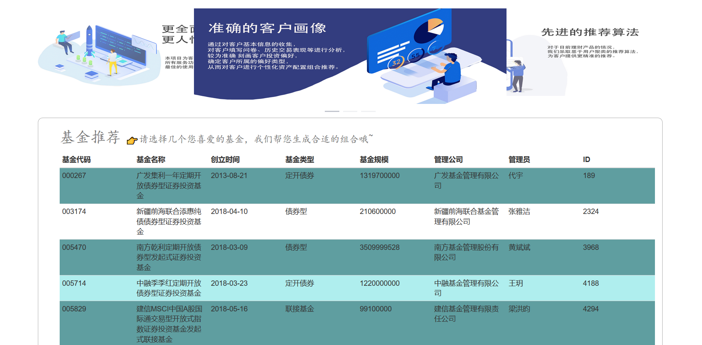

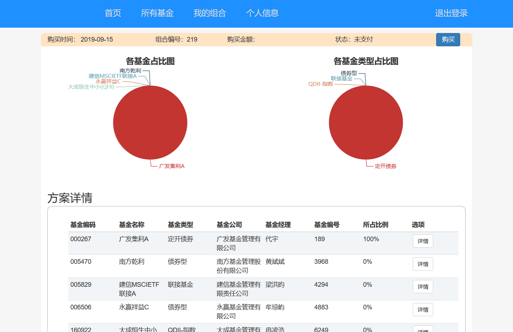

##### UI7 fund composition details page

Click on `详情` to see the corresponding fund details and jump to the `Fund details page`.

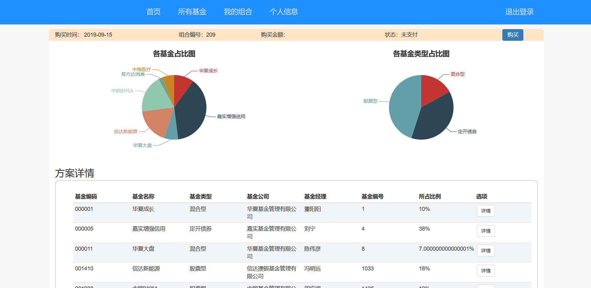

##### UI8 buy fund page

In the `fund composition details page`, clicking the `Buy` button in the upper right corner to purchase the fund compostion.

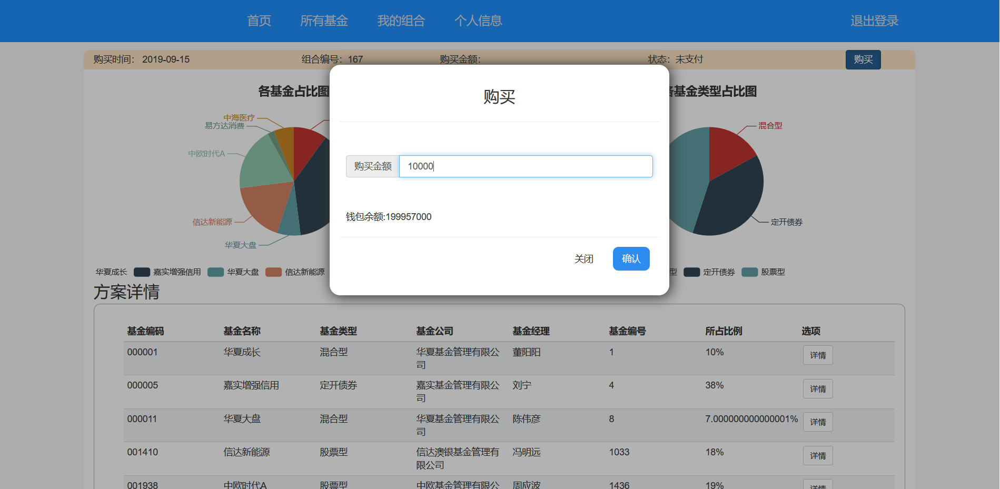

##### UI9 my composition page

Click the `我的组合` button in the upper navigation bar to view the information and status of the fund composition that the user has purchased. Click the `详情` button to go to the `My composition Details Page`.

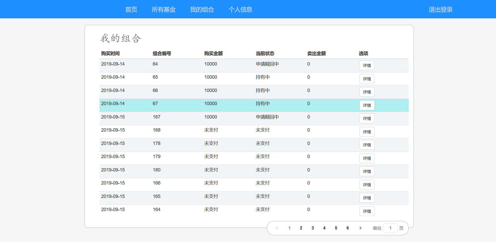

##### UI10 My composition Details Page

Here is the details of the fund combination that the user has purchased. Click on the `赎回` button in the upper right corner to apply for redemption.

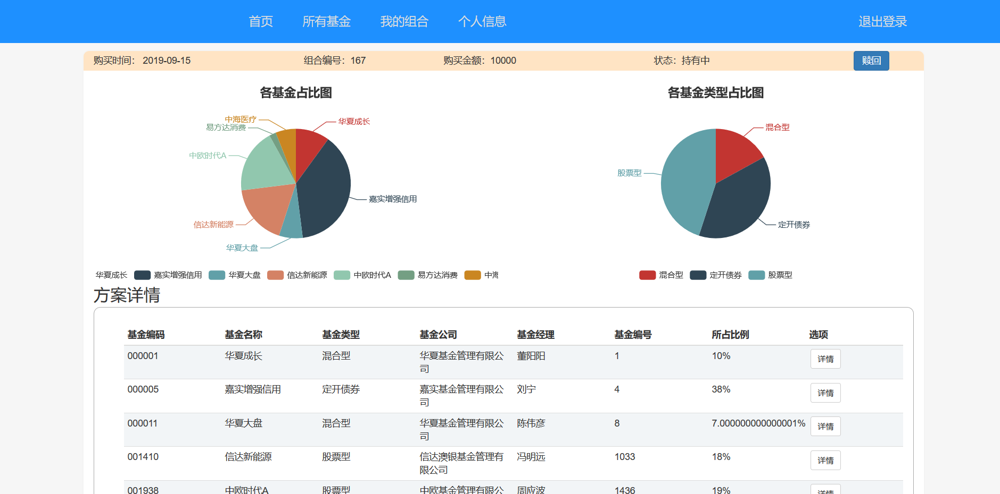

##### UI11 All funds page

Users can view all the funds that are common, click the `查看` button to enter the `Fund details page`.

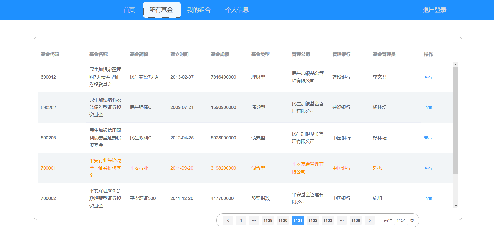

##### UI12 Fund details page

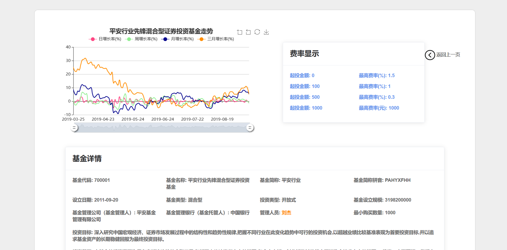

##### UI13 Personal information page

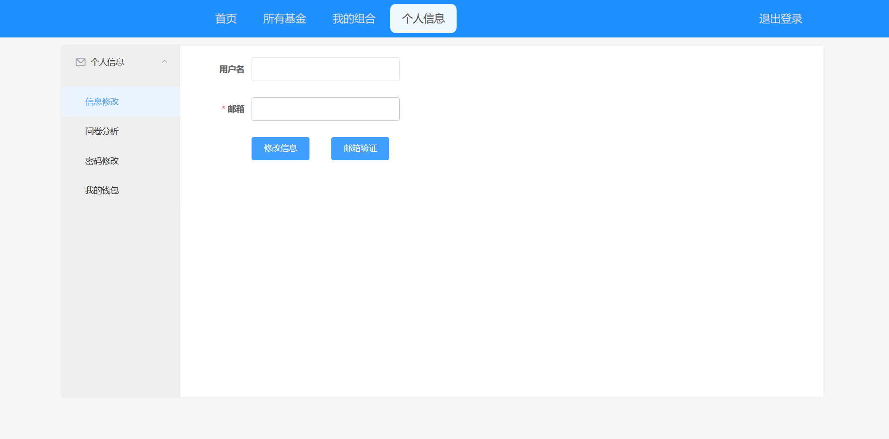

##### UI14 Questionnaire analysis page

Click the `重填文件` button to jump to the `fill questionnaire page` and re-fill the questionnaire.

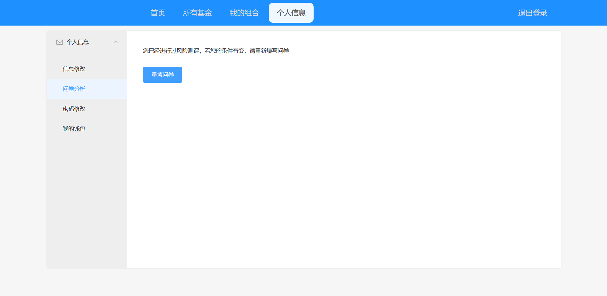

##### UI15 My wallet page

Display the record of the user's wallet balance changes, click the `充值` and `提现` buttons to enter the `Recharge page` and the `Withdraw page` respectively.

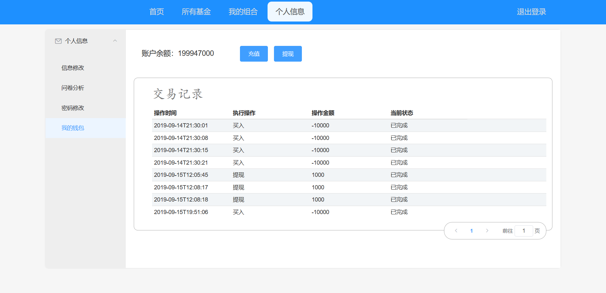

##### UI16 Change password page

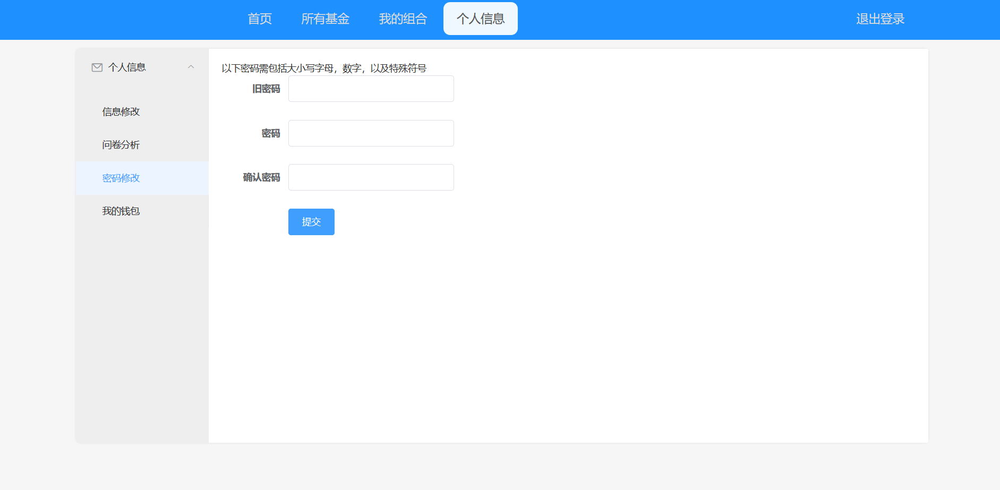

##### UI17 Recharge/Withdraw page

After confirming the recharge, users will enter the Alipay payment page and confirm the withdrawal to the Alipay.

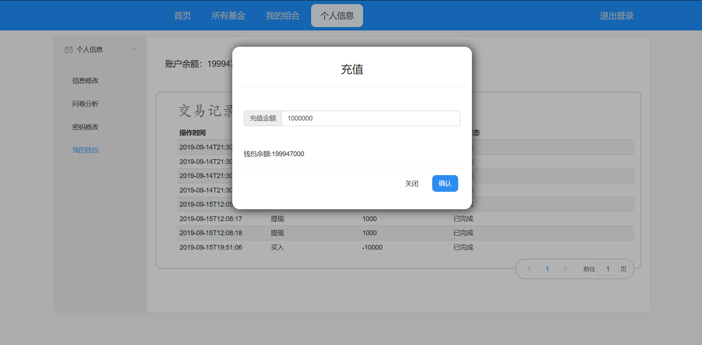

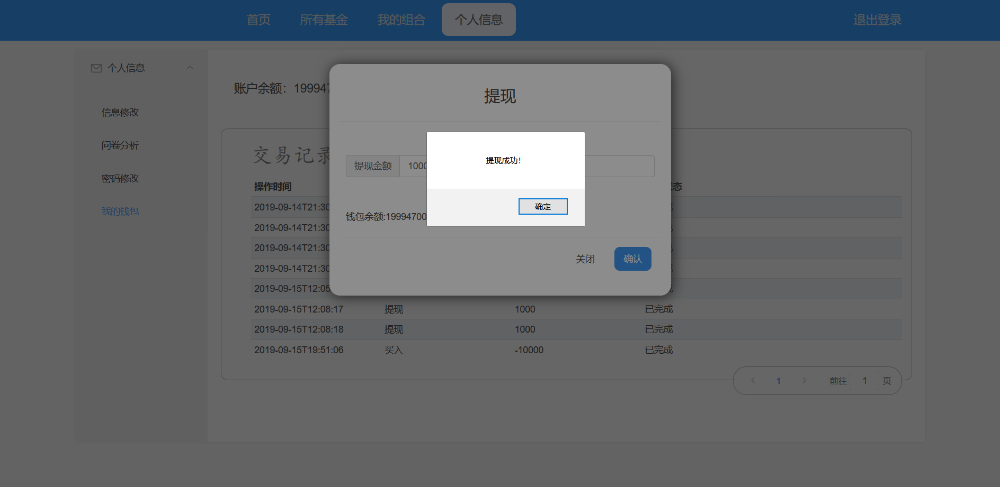

##### UI18 manager login page

Click `管理员登录` on the user login page to enter the page.

##### UI19 Super administrator manages the rest of the managers page

Super administrators can add and modify information from other managers.

##### UI20 Modify Fund Information Page

The super administrator can manually modify the information of the funds that displayed to the users.

##### UI21 Administrator change password page

##### UI22 Manage consumer page

Administrators can query and ban consumer users

#### 3.1.2 Communication Interface

Web and server communicate in REST mode

### 3.2 Functional Requirements

#### 3.2.1 Password is forgotten

##### 3.2.1.1 Description of the feature

When the user forgets the login password, the password will be retrieved through the email verification.

Priority = high

##### 3.2.1.2 Stimulus/Response Sequence

- Stimulus: User clicks "Forgot Password"
  - Response: The system displays the mailbox verification page
- Stimulus: User inputs the registered email address, click to send
  - Response: The system verifies the email and sends a reset password link to this email.
- Stimulus: User enters the mailbox and click on the link
  - Response: The system displays the interface of resetting password .
- Stimulus: User inputs new password and submits
- Response: The system updates the user's password and jumps to the login interface.
- Stimulus: User inputs unverified email
  - Response: The system prompts “this email is unverified."
- Stimulus: Users blocked by the system input email for verification
  - Response: The system prompts “this account has been disabled.”

##### 3.2.1.3 Related functional requirements

| interface | Description of Requirement |
| ---- | :------- |
| Forget.Start  |  User performs "Forget Password" operation, see Forget.Verify |
|      |        |
|Forget.Verify|The user retrieves the password through the email verification|
|Forget.Verify.Input.Email| The system allows the user to input the email in the interface of password retrievalling，see Forget.Input.Email |
|Forgrt.Verify.Email.Send| The system sends verification information to the user's email |
|Forget.Verufy.Success| The email verification is successful, then let the user enter the modify password interface, see Forget.ChangePassword|
|Forget.Verify.Failure|The email verification is failed, the system prompts the failure message, see Forget.End|
|      |        |
|Forget.ChangePassword.Start|User starts to change password|
|Forget.ChangePassword.Input|The system allows the user to enter a new password in the retrieve password interface, see Forget.Input|
|Forget.ChangePassword.Update|The system updates the user's data and returns to the main page, see Forget.End|
|      |        |
|Forget.Input|The system should allow the user to input with the keyboard during the process of "Forget  Password"|
|Forget.Input.Email|The system allows the user to input an email address|
|Forget.Input.Password|The system allows the user to  input a new password|
|Forget.Input.Invalid|When the user input information is in the wrong format, the system rejects the user input and displays the input information is in the wrong format.|
|      |        |
|Forget.End|The user returns to the login interface after retrieving the password|

---

#### 3.2.2 Fill in the questionnaire

##### 3.2.2.1 Feature description

New users fill out relevant questionnaires when they first enter the system, in order to analyze users

Priority = high

##### 3.2.2.2 Stimulus/Response Sequence

- Stimulus: new users enter the system for the first time
  - Response: The system displays the set questionnaire and asks the user to fill in
- Stimulus: users fill out the questionnaire and submit
  - Response: The system saves the user questionnaire information and jumps to the main page
- Stimulus: Questionnaire is not completed
  - Response: The system prompts that the questionnaire is incomplete and will not save the questionnaire.

##### 3.2.2.3 Related functional requirements

| interface | Description of Requirement |
| ---- | :------- |
|AddQuestionnaire.Start| The new user enters the system for the first time and performs the questionnaire operation. see AddQuestionaire.Input|
|      |          |
|AddQuestionnaire.Input|  The system allows the user to enter with the keyboard in the questionnaire filling interface.  |
|AddQuestionnaire.Input.Finish|The user completes the questionnaire and the system updates the user questionnaire information. see AddQuestionnaire.Update|
|AddQuestionnaire.Input.Invalid|System prompt format error when user input format is wrong|
|AddQuestionnaire.Input.Incomplete|When the user questionnaire information is incomplete, the system reminds the user to fill in the questionnaire completely|
|      |          |
|AddQuestionnaire.Update|System Update User Questionnaire Database|
|      |          |
|AddQuestionnaire.End|The user completes the questionnaire and enters the main page|

---

#### 3.2.3 Modify the questionnaire

##### 3.2.3.1 Feature description

Old users can re-fill the questionnaire at any time, so that the system can get the latest information of the user and analyze the user more accurately.

Priority = high

##### 3.2.3.2 Stimulus/Response Sequence

- Stimulus: Old users initiate refilling questionnaire requests
  - Response: The system displays the questionnaire information modification interface.
- Stimulus: users modify the questionnaire and submit
  - Response: The system saves the user's latest questionnaire information and jumps to the main page.
- Stimulus: Questionnaire is not completed
  - Response: The system prompts that the questionnaire is incomplete and will not save the questionnaire.

##### 3.2.3.3 Related functional requirements

| interface | Description of Requirement |
| ---- | :------- |
|AdjustQuestionnaire.Start| The old user enters the user information interface, requests to re-fill the questionnaire, and performs the modification of the questionnaire operation，see AdjustQuestionaire.Input|
|      |          |
|AdjustQuestionnaire.Input|  The system allows the user to enter with the keyboard in the questionnaire modification interface.  |
|AdjustQuestionnaire.Input.Finish|The user completes the modification of the questionnaire and the system updates the user questionnaire information. see AdjustQuestionnaire.Update|
|AdjustQuestionnaire.Input.Invalid|System prompt format error when user input format is wrong|
|AdjustQuestionnaire.Input.Incomplete|When the user questionnaire information is incomplete, the system reminds the user to fill in the questionnaire completely.|
|      |          |
|AdjustQuestionnaire.Update|System Update User Questionnaire Database|
|      |          |
|AdjustQuestionnaire.End|The user completes the modification of the questionnaire and returns to the user information interface|

---

#### 3.2.4 View the content of the questionnaire

##### 3.2.4.1 Feature description

Users can check the contents of the questionnaire so as to make timely changes and get more accurate recommendations

Priority = low

##### 3.2.4.2 Stimulus/Response Sequence

- Stimulus: Old users view the content of the questionnaire
  - Response: The system displays the user's latest questionnaire content
- Stimulus: User chooses to change the questionnaire information
  - Response: The system performs modificating questionnaire operation

##### 3.2.4.3 Related functional requirements

| interface | Description of Requirement |
| ---- | :------- |
|ViewQuestionnaire.Start|The user enters the personal information interface and requests to view the contents of the questionnaire. see ViewQuestionnaire.Detail|
|      |          |
|ViewQuestionnaire.Detail|User view questionnaire details|
|ViewQuestionnaire.Detail.Adjust|User performs modificating questionnaire operation|
|ViewQuestionnaire.Finish|Complete the view details operation, see ViewQuestionnaire.End|
|      |          |
|ViewQuestionnaire.End|The user ends the viewing of the questionnaire and returns to the user information interface.|

---

#### 3.2.5 User Modifying Personal Information

##### 3.2.5.1 Feature Description

A successful login user modifies personal information (password, email)

Priority = high

##### 3.2.5.2 Stimulus/response sequence

- Stimulus: User requests to change password
  - Response: The system displays the password change interface.
- Stimulus: Users fill in old and new passwords and submit
  - Response: The user's password is updated after the system verifies the old password.
- Stimulus: User fills in the wrong old password and submits
  - Response: The system prompts that the password is entered incorrectly.
- Stimulus: The new password format is incorrect
  - Response: The system prompts the password format error.
- Stimulus: User requests to modify the mailbox
  - Response: The system displays the modifing mailbox interface.
- Stimulus: User enters new mailbox and submits
  - Response: The system updates the user's mailbox and prompts the user to verify
- Stimulus: User input email format is incorrect
  - Response: The system prompts the mailbox is in the wrong format.

##### 3.2.5.3 Related functional requirements

| interface | Description of Requirement |
| ---- | :------- |
|AdjustUserInfo.Start|The user enters the personal information interface and begins to modify the personal information.|
|      |          |
|AdjustUserInfo.AdjustPassword|User change the password|
|AdjustUserInfo.AdjustPassword.Input|The system allows the user to enter the old password and the new password with the keyboard in the password modification interface. see AdjustUserInfo.Input|
|AdjustUserInfo.AdjustPassword.Submit|When the user submits, the system displays the password change is successful and updates the user data, see AdjustUserInfo.Update|
|AdjustUserInfo.AdjustPassword.Cancel|When the user cancels the modification, the system closes the password modification interface and returns to the personal information interface|
|AdjustUserInfo.AdjustPassword.End|End the password modification operation，see AdjustUserInfo.End|
|      |          |
|AdjustUserInfo.AdjustEmail|User modifies email|
|AdjustUserInfo.AdjustEmail.Input|The system allows the user to enter the new email address by keyboard in the password modification interface. See AdjustUserInfo.Input|
|AdjustUserInfo.AdjustEmail.Submit|When the user submits, the system displays successful mailbox changes and updates user data, see AdjustUserInfo.Update|
|AdjustUserInfo.AdjustEmail.Cancel|When the user cancels the modification, the system closes the mailbox modification interface and returns to the personal information interface.|
|AdjustUserInfo.AdjustEmail.End|End the modify mailbox operation, see AdjustUserInfo.End|
|      |         |
|AdjustUserInfo.Input|The system allows users to enter their personal information by keyboard|
|AdjustUserInfo.Input.Invalid|When the user input information format is wrong, the system refuses to input and prompts the input information is incorrect.|
|      |         |
|AdjustUserInfo.Update|System update user personal information|
|AdjustUserInfo.Update.Password|System update user's password|
|AdjustUserInfo.Update.Email|System update user's email|
|      |         |
|AdjustUserInfo.End|User ends the task of modifying personal information|

---

#### 3.2.6 Wallet recharge

##### 3.2.6.1 Feature Description

Successfully logged in users recharge their wallets, making it easy to purchase funds

Priority = high

##### 3.2.6.2 Stimulus/Response Sequence

- Stimulus:  the user initiates the wallet recharge operation
  - Response: The system displays the recharge interface
- Stimulus: User enters the recharge amount and submits
  - Response: The system transfers to Alipay payment, prompts the user has paid successfully, and updates the wallet amount record.
- Stimulus:  User submits recharge request when network is interrupted
  - Response: The system prompts "No Internet connection, unable to connect to alipay, use local payment"

##### 3.2.6.3 Related functional requirements

| interface | Description of Requirement |
| ---- | :------- |
|Recharge.Start|The user enters the card package and requests recharge, see Recharge.Pay|
|      |          |
|Recharge.Pay|User recharges through Alipay payment|
|Recharge.Pay.Input|The system allows the user to input the payment amount by keyboard in the recharge interface. see Recharge.Input|
|Recharge.Pay.Submit|When the user clicks submit, the system transfers to alipay to pay, and updates the wallet amount change record, see Recharge.Update|
|Recharge.Pay.Unconnected|If the user submits when the network is interrupted, the system prompts payment failure, exit the recharge interface, see Recharge.End|
|Recharge.Pay.Cancel|The user cancels the payment, the system exits the recharge interface and returns the card package. see Recharge.End|
|Recharge.Pay.Finish|When the user completes the payment, it will be prompted recharge successfully and return the card package. see Recharge.End|
|      |          |
|Recharge.Input.Start|The system starts to input tasks|
|Recharge.Input.Invalid|When the user enters information in an incorrect format, the system rejects the input and displays that the input information is in an incorrect format|
|      |          |
|Recharge.Update|The system updates the wallet amount change record|
|      |          |
|Recharge.End|The system finishes the recharge task and returns the card packet|

---

#### 3.2.7 Wallet withdrawal

##### 3.2.7.1 Feature Description

Successfully logged in users withdraw cash from the wallet

Priority = high

##### 3.2.7.2 Stimulus/Response Sequence

- Stimulus: User initiates wallet withdrawal operation
  - Response: The system displays the cash withdrawal interface
- Stimulus: User enters the withdrawal amount and submits.
  - Response: The system carries out alipay withdrawal operation and prompts that the withdrawal has been successful, and update the wallet balance and amount change records
- Stimulus: User submits withdrawal request when network is interrupted
  - Response: The system prompts "Unable to connect to alipay due to lack of Internet connection"

##### 3.2.7.3 Related functional requirements

| interface | Description of Requirement |
| ---- | :------- |
|Withdraw.Start|The user enters the card packet to request withdrawal, see Withdraw.Pay|
|      |          |
|Withdraw.Receive|The user withdraws money through Alipay collection|
|Withdraw.Receive.Input|The system allows users to input the withdrawal amount by keyboard in the withdrawal interface. see Withdraw.Input|
|Withdraw.Receive.Submit|When the user clicks submit, the system transfers to alipay for cash withdrawal and updates the wallet amount change record, see Withdraw.Update|
|Withdraw.Receive.Unconnected|If the user submits when the network is interrupted, the system prompts withdrawal failure, exit withdrawal interface, see Withdraw.End|
|Withdraw.Receive.Cancel|The user cancels the withdrawal, the system exits the withdrawal interface and returns to the card package, see Withdraw.End|
|Withdraw.Receive.Finish|The user completes the withdrawal, the system prompts the withdrawal to be successful, and returns the card package.see Withdraw.End|
|      |          |
|Withdraw.Input.Start|The system starts to input tasks|
|Withdraw.Input.Invalid|When the user enters information in an incorrect format, the system rejects the input and displays that the input information is in an incorrect format|
|      |          |
|Withdraw.Update|The system updates the wallet amount change record|
|      |          |
|Withdraw.End|The system finishes the withdrawal task and returns to the interface of card package|

---

#### 3.2.8 View wallet balance change record

##### 3.2.8.1 Feature Description

Successfully logged in users check the changes in wallet balances, to know the income and expenditure situation

Priority = low

##### 3.2.8.2 Stimulus/Response Sequence

- Stimulus: User requests to view wallet balance change record
  - Response: The system displays the wallet balance record interface.

##### 3.2.8.3 Related functional requirements

| interface | Description of Requirement |
| ---- | :------- |
|ViewFinanceRecord.Start|The user enters the card package interface and requests to view the wallet balance change record. see ViewFinanceRecord.Check|
|      |          |
|ViewFinanceRecord.Check|User view wallet balance changes|
|ViewFinanceRecord.Check.Cancel|The user cancels to view the balance change, returns the card package, see ViewFinanceRecord.End|
|ViewFinanceRecord.Finish|Complete the operation to view the balance change, see ViewFinanceRecord.End|
|      |          |
|ViewFinanceRecord.End|The user finishes the task of checking the change of wallet balance and returns to the interface of card package|

---

#### 3.2.9 Purchase Fund Portfolio

##### 3.2.9.1 Feature Description

The successfully logged-in user selects the fund that he wants to purchase according to the recommended list, and completes the purchase fund operation according to the recommended ratio, and obtains the income.

Priority = high

##### 3.2.9.2 Stimulus/Response Sequence

- Stimulus: New users request to enter the purchase interface
  - Response: The system displays the recommended fund portfolio
- Stimulus: The user chooses the fund portfolio to view
  - Response: System display fund portfolio information
- Stimulus: Old users request to enter the purchase interface
  - Response: The system displays a list of recommended funds
- Stimulus: The user chooses the fund to be purchased and submits
  - Response: System display fund portfolio recommendation results
- Stimulus: Users select a fund portfolio and request a purchase
  - Response: The system displays the purchase interface
- Stimulus: User enters the purchase amount and requests to purchase
  - Response: The system performs a purchase operation, prompts the purchase is successful, and updates the wallet balance change record and consumption record.
- Stimulus: User purchase amount does not reach fund minimum
  - Response: The system prompts that the minimum amount has not been met
- Stimulus: Users have not reached the minimum purchase share of the fund
  - Response: The system prompts that the minimum purchase share has not been reached

##### 3.2.9.3 Related functional requirements

| interface | Description of Requirement |
| ---- | :------- |
|BuyFundComposition.Start|The user enters the purchase interface and requests to make a purchase operation.|
|      |          |
|BuyFundComposition.Recommend|The system recommends the fund portfolio to the user|
|BuyFundComposition.Recommend.NewUser|The system recommends a fixed fund portfolio to new users|
|BuyFundComposition.Recommend.OldUser.FundList|The system recommends a list of suitable funds to old users|
|BuyFundComposition.Recommend.OldUser.Select|Old users choose the funds they need to buy|
|BuyFundComposition.Recommend.OldUser.GetResult|Old users get fund portfolio recommendation results|
|BuyFundComposition.Recommend.Select|User view recommended fund portfolio details|
|BuyFundComposition.Recommend.Submit|The user submits the fund portfolio purchase application and enters the fund portfolio purchase interface. see BuyFundComposition.Pay|
|       |         |
|BuyFundComposition.Pay.Start|The user enters the fund portfolio purchase interface and begins to perform the purchase operation|
|BuyFundComposition.Pay.Input|The system allows the user to enter the purchase amount in the fund portfolio purchase interface. see BuyFundComposition.Input|
|BuyFundComposition.Pay.Submit|The user submits the purchase application, and the system prompts whether to confirm the purchase|
|BuyFundComposition.Pay.Complete|The user completes the payment, updates the user purchase record and wallet balance change record, see BuyFundComposition.Update|
|BuyFundComposition.Pay.Cancel|The user cancels the payment and returns to the purchase interface. see BuyFundComposition.Start|
|       |          |
|BuyFundComposition.Input.Start|The system performs the input task|
|BuyFundComposition.Input.Invalid|When the user enters information in an incorrect format, the system rejects the input and displays that the input information is in an incorrect format|
|BuyFundComposition.Input.Insufficient|User input amount is insufficient, return to the purchase interface, see BuyFundComposition.Pay.Start|
|       |          |
|BuyFundComposition.Update|System update database|
|       |          |
|BuyFundComposition.End|User completes purchasing|

---
#### 3.2.10 View purchase information record

##### 3.2.10.1 Feature Description

Successfully logged in users view the purchase information record to understand the income of each fund

Priority = low

##### 3.2.10.2 Stimulus/Response Sequence

- Stimulus: User requests to view purchase information record
- Response: The system displays a list of purchase information records
- Stimulus: User selects a single purchase record request to view
- Response: The system displays the details of the selected purchase record.

##### 3.2.10.3 Related functional requirements

| Interface | Requirements Description |
| ---- | :------- |
|ViewCompositionOfCustomer.Start|User requests to view the purchase information change record, see ViewCompositionOfCustomer.Check|
|      |          |
|ViewCompositionOfCustomer.Check|Users view purchase record changes|
|ViewCompositionOfCustomer.Check.Select|Users view individual purchase records, see ViewCompositionOfCustomer.Select|
|ViewCompositionOfCustomer.Check.Cancel|Cancel the view and return to the main page, see ViewCompositionOfCustomer.Start|
|ViewCompositionOfCustomer.Finish|Complete to view the purchase record change operation, see ViewCompositionOfCustomer.End|
|      |          |
|ViewCompositionOfCustomer.Select.Detail|Users select a single purchase record to view details|
|ViewCompositionOfCustomer.Select.End|Users complete the view of the individual purchase record details, return to the purchase record list interface, see ViewCompositionOfCustomer.Check|
|      |          |
|ViewCompositionOfCustomer.End|User completes the view of the purchase record and returns to the main page|

---

#### 3.2.11 Redemption Fund

##### 3.2.11.1 Feature Description

Successfully logged in users redeem the fund portfolio that has been purchased and sold

Priority = high

##### 3.2.11.2 Stimulus/Response Sequence

- Stimulus: User requests to view purchase history
  - Response: The system displays the purchase record interface
- Stimulus: Users choose a fund portfolio and request redemption
  - Response: The system prompts whether to confirm the redemption
- Stimulus: User confirms redemption
  - Response: The status of the fund portfolio is updated to be sold, and the fund enters the redemption period during which the user cannot perform any operations on the fund portfolio.
- Stimulus: Entering a new day market trading period
  - Response: The system automatically redeems the fund, updates the fund portfolio status and wallet balance change record

##### 3.2.11.3 Related functional requirements

| Interface | Requirements Description |
| ---- | :------- |
|SellFundComposition.Start|User enters the purchase record interface and requests a redemption operation|
|       |         |
|SellFundComposition.Select|Users choose a fund portfolio that needs to be redeemed |
|SellFundComposition.Select.Detail|Users view single fund portfolio details |
|SellFundComposition.Select.Submit|User submits the fund combination that needs to be redeemed, the system prompts whether to confirm the redemption|
|SellFundComposition.Select.Confirm|User confirms redemption, system updates fund combination status, see SellFundComposition.Update|
|SellFundComposition.Select.Cancel|User cancels redemption, the system returns to the purchase record interface, see SellFundComposition.Start|
|       |         |
|SellFundComposition.Wait|The fund enters the redemption period, the fund portfolio is to be sold |
|SellFundComposition.Wait.End|Enter a new day market trading period, end the redemption period, the system automatically redeems the fund, updates the fund portfolio status and wallet balance change record, see SellFundComposition.Update|
|       |         |
|SellFundComposition.Update|System Update Database|
|SellFundComposition.Update.ToBeSold|System Update Fund Portfolio Status is to be sold |
|SellFundComposition.Update.Sold|System Update Fund Portfolio Status is Sold, Update Purchase Record and Balance Change Record |
|       |          |
|SellFundComposition.End|User End Redemption Task|

---

#### 3.2.12 Adding funds

##### 3.2.12.1 Feature Description

Successfully logged in administrators to increase fund operations

Priority = low

##### 3.2.12.2 Stimulus/Response Sequence

- Stimulus: Administrator requests to increase funds
- Response: System display fund increase interface
- Stimulus: The administrator enters fund information (including fund code, minimum purchase amount, minimum holding share, information link) and submits
- Response: The system prompts for increased success and updates the fund list
- Stimulus: The administrator input information format is incorrect
- Response: The system prompts for a format error.

##### 3.2.12.3 Related Functional Requirements

| Interface | Requirements Description |
| ---- | :------- |
|AddFund.Start|Administrator requests to add funds, the system enters the editing interface, see AddFund.AddInfo|
|      |          |
|AddFund.AddInfo.Input|Administrator enters information about the added funds, including the fund code, minimum purchase amount, minimum holding share, information link, see AddFund.Input|
|AddFund.AddInfo.Submit|Administrator submits new fund information, the system prompts whether to confirm the submission|
|AddFund.AddInfo.Confirm|Administrator confirms submission, the system saves the information to the database, see AddFund.Update|
|AddFund.AddInfo.Cancel|The administrator cancels the submission, the system returns to the fund list interface, see AddFund.End|
|      |          |
|AddFund.Input.Start|The system starts to enter tasks|
|AddFund.Input.Invalid|When the administrator input information is in the wrong format, the system refuses to input and displays the input information in the wrong format |
|      |          |
|AddFund.Update|System Update Fund Database|
|      |          |
|AddFund.End|Administrator ends adding funds, the system returns to the main interface|

---

#### 3.2.13 Modify Fund Information

##### 3.2.13.1 Feature Description

The administrator who successfully logged in to modify the fund information operation

Priority = low

##### 3.2.13.2 Stimulus/Response Sequence

- Stimulus: The administrator selects a single fund request to modify the fund information
- Response: System display fund modification interface
- Stimulus: The administrator enters the fund information to be modified and submits
- Response: The system prompts that the modification is successful and updates the fund list.
- Stimulus: The administrator input information format is incorrect
- Response: The system prompts for a format error.

##### 3.2.13.3 Related functional requirements

| Interface | Requirements Description |
| ---- | :------- |
|AdjustFund.Start|Administrator requests to modify the fund, the system enters the editing interface, see AdjustFund.EditInfo|
|      |          |
|AdjustFund.EditInfo.Input|Administrator enters the information that the fund needs to modify, see AddFund.Input|
|AdjustFund.EditInfo.Submit|Administrator submits the revised fund information, the system prompts whether to confirm the submission|
|AdjustFund.EditInfo.Confirm|Adminify the submission, the system will save the information into the database, see AdjustFund.EditInfo|
|AdjustFund.EditInfo.Cancel|The administrator cancels the submission, the system returns to the fund list interface, see AdjustFund.EditInfo|
|      |          |
|AdjustFund.Input.Start|The system starts to input tasks|
|AdjustFund.Input.Invalid|When the administrator input information is in the wrong format, the system refuses to input and displays the input information in the wrong format |
|      |          |
|AdjustFund.Update|System Update Fund Database|
|      |          |
|AdjustFund.End|Administrator finishes modifying the fund, the system returns to the main interface|

---

#### 3.2.14 View all funds

##### 3.2.14.1 Feature Description

A successful login user or administrator requests to view all funds and get paginated results

Priority = low

##### 3.2.14.2 Stimulus/Response Sequence

- Stimulus: User or administrator requests to view all funds
- Response: System display fund list interface
- Stimulus: User or administrator selects the number of pages
- Response: The system displays the corresponding fund list
- Stimulus: User or administrator selects a single fund to request details
- Response: The system displays the fund details (including fund code, name, abbreviation, pinyin, date of establishment, type, design scale, management company, management bank, history, investment type, investment target, minimum purchase amount, investment range, minimum holding) There are shares, fund managers, fund manager links, details links)

##### 3.2.14.3 Related Functional Requirements

| Interface | Requirements Description |
| ---- | :------- |
|ViewAllFunds.Start|User requests to view all funds, see ViewAllFunds.Paging|
|      |          |
|ViewAllFunds.Paging|Users Pagination View All Funds List|
|ViewAllFundsr.Paging.Select|Users view single fund information, see ViewAllFunds.Select|
|ViewAllFunds.Paging.Cancel|Cancel the view and return to the main page, see ViewAllFunds.Start|
|ViewAllFunds.Paging.Finish|Complete to view all fund operations, see ViewAllFunds.End|
|      |          |
|ViewAllFunds.Select.Detail|Users select a single fund to view details|
|ViewAllFunds.Select.End|Users complete the view of the single fund details and return to all fund list interfaces, see ViewAllFunds.Paging|
|      |          |
|ViewAllFunds.End|Users complete all fund tasks and return to the main page|

---

#### 3.2.15 View fund rate

##### 3.2.15.1 Feature Description

Successfully logged in users or administrators request to view fund rates and get historical changes in fund rates

Priority = low

##### 3.2.15.2 Stimulus/Response Sequence

- Stimulus: User or administrator selects a single fund to view information
- Response: System display fund information interface
- Stimulus: User or administrator requests to view the fund's fund rate
- Response: The system displays the fund rate interface (including fund rate information and changes)

##### 3.2.15.3 Related Functional Requirements

| Interface | Requirements Description |
| ---- | :------- |
|ViewFundBuyRate.Start|Users enter the fund details interface and request to view the fund rate change record, see ViewFundBuyRate.Check|
|      |          |
|ViewFundBuyRate.Check|Users view fund rate changes|
|ViewFundBuyRate.Check.Cancel|Users cancel the change in fund rate and return to the fund details interface, see ViewFundBuyRate.End|
|ViewFundBuyRate.Finish|Complete to view the fund rate change operation, see ViewFundBuyRate.End|
|      |          |
|ViewFundBuyRate.End|Users end to view the fund rate change task, return to the fund details interface|

---

#### 3.2.16 View Fund Net Value

##### 3.2.16.1 Feature Description

Successfully logged in users or administrators request to view the fund's net value and get a historical change in the fund's net worth.

Priority = low

##### 3.2.16.2 Stimulus/Response Sequence

- Stimulus: User or administrator selects a single fund to view information
- Response: System display fund information interface
- Stimulus: The user or administrator requests to view the fund's net worth
- Response: The system displays the fund's net value interface (including fund equity information and changes)

##### 3.2.16.3 Related Functional Requirements

| Interface | Requirements Description |
| ---- | :------- |
|ViewFundNetValue.Start|User enters the fund details interface and requests to view the fund's net value change record, see ViewFundNetValue.Check|
|      |          |
|ViewFundNetValue.Check|Users view changes in fund equity |
|ViewFundNetValue.Check.Cancel|Users cancel the change of the fund's net value and return to the fund details interface, see ViewFundNetValue.End|
|ViewFundNetValue.Finish|Complete to view the fund's net value change operation, see ViewFundNetValue.End|
|      |          |
|ViewFundNetValue.End|Users end to view the fund's net value change task, return to the fund details interface|

---

#### 3.2.17 New users view the default fund portfolio

##### 3.2.17.1 Feature Description

A new user who successfully logged in sees the recommendation result and gets the default recommended fund combination.

Priority = low

##### 3.2.17.2 Stimulus/Response Sequence

- Stimulus: New users request to see recommendations
- Response: The system displays the default fund portfolio
- Stimulus: New users request to view recommendation result details
- Response: The system displays the default fund portfolio details (including fund information, percentage)

##### 3.2.17.3 Related Functional Requirements

| Interface | Requirements Description |
| ---- | :------- |
|ViewDefaultFundComposition.Start|User requests to view the default fund combination, see ViewDefaultFundComposition.Check|
|      |          |
|ViewDefaultFundComposition.Check|Users view the default fund portfolio|
|ViewDefaultFundComposition.Check.Detail|Users view the default fund portfolio details (including funds, percentage), see ViewDefaultFundComposition.Detail|
|ViewDefaultFundComposition.Check.Finish|Complete to view the default fund combination operations, see ViewDefaultFundComposition.End|
|      |          |
|ViewDefaultFundComposition.Detail.Select|Users view single fund information, see ViewDefaultFundComposition.Select|
|ViewDefaultFundComposition.Detail.Cancel|Cancel view, return to the default fund combination interface, see ViewDefaultFundComposition.Check|
|ViewDefaultFundComposition.Detail.Finish|Complete the view of all fund portfolio details, return to the fund portfolio interface, see ViewDefaultFundComposition.Check|
|      |          |
|ViewDefaultFundComposition.Select.Detail|Users select a single fund to view details|
|ViewDefaultFundComposition.Select.End|Users complete the view of the single fund details, return to the fund portfolio details interface, see ViewDefaultFundComposition.Detail|
|      |          |
|ViewDefaultFundComposition.End|Users complete the view of the default fund portfolio task, return to the main page |

#### 3.2.18 Add administrator

##### 3.2.18.1 Description of the feature

An authenticated master administrator adds administrators by specifying user names and passwords

Priority = low

##### 3.2.18.2 Stimulus/response sequence
- stimulus: the master administrator requests additional administrators
- response: system display administrator adds interface
- stimulation: the master administrator enters administrator related information (including user name and password) and submits it
- response: system update administrator list
- stimulus: input information format error
- response: the system prompts that the input information is formatted incorrectly

##### 3.2.18.3 Related functional requirements
| interface | requirements description |
| -- | :------ |
| Addmanager.Start | main administrator requests to add an administrator, the system enters the editing interface, see Addmanager.AddInfo |
|      |          |
| Addmanager.AddInfo.Input | main administrator input added administrator information, including user name, password, see Addmanager.Input |
| AddManager. AddInfo. Submit | new administrator information, the system confirms whether or not to submit|
| AddManager. AddInfo. Confirm | Confirm to submit the master administrator, system information in the database, see AddManager. Update |
| AddManager. AddInfo. Cancel | submit the master administrator, system returns the administrator list interface, see AddManager. End |
|      |          |
| Addmanager.Input.Start| system starts to input task |
| Addmanager.Input.Invalid | if the primary administrator enters the information in an invalid format, the system rejects the input and displays that the input is formatted incorrectly |
|      |          |
| Addmanager.Update | system updates administrator database |
|      |          |
| Addmanager.End | add administrator, the system returns to administrator list interface |

---

#### 3.2.19 Change manager
##### 3.2.19.1 Description of the feature

An authenticated master administrator modifies administrator information (especially passwords)

Priority = low

##### 3.2.19.2 Stimulus/response sequence

- stimulus: the master administrator selects a single administrator account to request modification
- response: the system displays the administrator information (password) modification interface
- stimulation: the master administrator enters a new password and submits it
- response: the system prompts that the modification is successful and updates the list of administrators

##### 3.2.19.3 Related functional requirements

| interface | requirements description |
| -- | :------ |
|Adjustmanager.Start | master administrator requests to modify the administrator (password), and the system enters the edit interface, refers to Adjustmanager.Edit |
|      |          |
| Adjustmanager.Edit.Input | the primary administrator enters the administrator passwords to be modified, refers to Adjustmanager.Input |
| AdjustManager. Edit. Submit | the master administrator submit revised administrator information, the system prompts whether to confirm the submission|
| AdjustManager. Edit. Confirm | confirm to submit the master administrator, system stores the information in the database, see AdjustManager. Update |
| AdjustManager. Edit. Cancel | submit the master administrator, system returns the administrator list interface, see AdjustManager. End |
|      |          |
| AdjustManager. Input. Start |  system begins to input task|
| AdjustManager. Input. Invalid | the master administrator inputs format error, refuses to Iinput and displays the wrong input format|
|      |          |
| Adjustmanager.Update | system updates administrator database |
|      |          |
| Adjustmanager.End | the primary administrator has finished modifying administrators and the system returns to the administrator list interface|

---
#### 3.2.20 View all administrators

##### 3.2.20.1 Description of the feature

An authenticated master administrator requests to see the administrator list for a pagination display

Priority = low

##### 3.2.20.2 Stimulus/response sequence

- stimulus: the master administrator requests to see all administrators
- response: the system displays the administrator list interface
- stimulus: master administrator selects pages
- response: the system displays a list of corresponding administrators
- stimulus: the master administrator selects a single administrator to request details
- response: system displays administrator details (including username, password, disabled or not)

##### 3.2.20.3 Related functional requirements

| interface | requirements description |
| -- | :------ |
|ViewAllManagers.Start| main administrator requests to view all administrators, see ViewAllManagers.Paging|
|      |          |
|ViewAllManagers.Paging| main administrator paging through the administrator list |
|ViewAllManagers.Paging.Select|The Select the master administrator to view a single administrator information, see ViewAllManagers. Select |
| ViewAllManagers. Paging. Cancel | cancel the check and return to the main page, see ViewAllManagers. Start |
| ViewAllManagers. Paging. Finish | finish to see all the administrator operation, see ViewAllManagers End |
|      |          |
| ViewAllManagers. Select. Detail | the master administrator to choose a single administrator to check the detailed information (including username, password, whether or not disabled) |
|     |      |
|ViewAllManagers. Select. End |the master administrator to complete a single administrator details view, return all administrators list interface, see ViewAllManagers. Paging |
|ViewAllManagers.End | the master administrator completes all administrator tasks and returns to the main page |

---
#### 3.2.21 Disable administrator

##### 3.2.21.1 Description of the feature

An authenticated master administrator selects a single administrator to disable operations, preventing that administrator from logging in and other operations

Priority = high

##### 3.2.21.2 Stimulus/response sequence

- stimulus: the master administrator requests to see the administrator
- response: the system displays the administrator list interface
- stimulus: the master administrator selects the administrator request to disable
- response: the system prompts that it is disabled and updates the administrator status

##### 3.2.21.3 Related functional requirements

| interface | requirements description |
| -- | :------ |
| Banmanager.Start | master administrator enters all administrators list and requests to disable administrators, see Banmanager.Select |
|      |          |
| Banmanager.Select | the master administrator selects the administrator account that needs to be disabled|
| Banmanager.Select.Submit | administrator submits the administrator account to be disabled, and the system prompts whether to disable or not|
| Banmanager. Select. Confirm | confirm to disable the master administrator, system Update the admin status, see BanManager. Update |
| Banmanager.Select.Cancel | the main administrator cancellations the submission and the system returns to the administrator list interface, see Banmanager.End |
|      |          |
| Banmanager. Update| system updates administrator database |
|      |          |
| Banmanager. End|When the master administrator ends disabling administrator, the system returns to the administrator list interface|

---
#### 3.2.22 Recovery manager

##### 3.2.22.1 Description of the feature

An authenticated master administrator selects a frozen administrator account and requests that it be unfrozen so that the administrator can resume normal functions

Priority = high

##### 3.2.22.2 Stimulus/response sequence

- stimulus: the master administrator requests to see all disabled administrators
- response: the system displays the disabled administrator list screen
- stimulation: the master administrator selects the administrator to unban and requests to unban
- response: the system prompts that the system has successfully unblocked and updates the administrator status

##### 3.2.22.3 Related functional requirements

| interface | requirements description |
| -- | :------ |
| Unbanmanager.Start | the master administrator enters the disabled administrator list and requests to restore the administrator, see unbanmanager.select |
|      |          |
| Unbanmanager.Select | the master administrator selects the administrator account that needs to be unblocked|
| UnbanManager. Select. Submit | The master administrator submits the administrator account that needs to be unblocked, and the system prompts whether to confirm the unblocked account |
| UnbanManager. Select. Confirm | The master administrator confirms to release administrator, system Update the admin status, see UnbanManager. Update |
| UnbanManager. Select. Cancel | the master administrator cancels the commit, system returns to disable the administrator list interface, see UnbanManager. Start |
|      |          |
| Unbanmanager. Update| system updates administrator database |
|      |          |
| Unbanmanager. End| administrator ends restoring administrator, the system returns to administrator list interface |

---

#### 3.2.23 Administrator changes personal password

##### 3.2.23.1 Description of the feature

A successful logon administrator requests a change in personal information (password)

Priority = low

##### 3.2.23.2 Stimulus/response sequence

- stimulus: administrator requests password change
- response: the system displays the password modification interface
- stimulation: the administrator enters the original password and the new password, and submits it
- response: the system prompts that the modification is successful and updates the administrator information
- stimulus: enter the wrong password
- response: the system prompts the original password error
- stimulus: incorrect password format
- response: system prompt format error

##### 3.2.23.3 Related functional requirements

| interface | requirements description |
| -- | :------ |
| AdjustManagerPersonalInfo. Start | the administrator enter personal information interface, began to modify personal information |
|      |          |
| AdjustManagerPersonalInfo. AdjustPassword | administrator changes the password|
| AdjustManagerPersonalInfo. AdjustPassword. Input | system allows the administrator at the interface to modify the password keyboard Input, fill in the old password, new password, see AdjustManagerPersonalInfo. Input |
| AdjustManagerPersonalInfo. AdjustPassword. Submit | administrator Submit, system displays password change is successful, and update the user data, see AdjustManagerPersonalInfo. Update |
| AdjustManagerPersonalInfo. AdjustPassword. Cancel | modified administrator, system shutdown password change interface, to return to the interface of personal information |
|  AdjustManagerPersonalInfo. AdjustPassword. End| end change passwords, see AdjustManagerPersonalInfo. End |
|      |         |
| AdjustManagerPersonalInfo. Input | system allows administrators to modify personal information interface |
| AdjustManagerPersonalInfo. Input. Invalid | administrator input format errors, ,system refuses to enter and prompt information|
|      |         |
| AdjustManagerPersonalInfo. Update | system updates personal information |
| AdjustManagerPersonalInfo. End | end the administrator to modify personal information task|

---
#### 3.2.24 View all consumers

##### 3.2.24.1 Description of the feature

The successfully logged in administrator requests a view of the consumer list to get the pagination results

Priority = low

##### 3.2.24.2 Stimulus/response sequence

- stimulus: administrator requests to view all consumers
- response: the system displays the consumer list interface
- stimulation: administrator selects pages
- response: the system displays a list of corresponding consumers
- stimulus: the master administrator selects a single consumer request for details
- response: system displays consumer details (including username, disabled or not)

##### 3.2.24.3 Related functional requirements

| interface | requirements description |
| -- | :------ |
|ViewAllCustomers.Start| administrator requests to view all consumers. See ViewAllCustomers.Paging|
|      |          |
|ViewAllCustomers.Paging| administrator views all consumer lists |
| ViewAllCustomers. Paging.  Select |administrator views a single user information, see ViewAllCustomers. Select |
| ViewAllCustomers. Paging. Cancel | cancel the check and return to the main page, see ViewAllCustomers. Start |
| ViewAllCustomers. Paging. Finish | finish seeing consumer operations, see ViewAllCustomers. End |
|      |          |
| ViewAllCustomers. Select. Detail | administrators  choose a single consumers to view the detailed information (including username, password, whether or not disabled) |
| ViewAllCustomers. Select. End |  administrators complete individual consumers to view details, return all consumers list interface, see ViewAllCustomers. Paging |
|      |          |
|ViewAllCustomers.End| administrator completes viewing all consumer tasks and return to the main page|

---
#### 3.2.25 Disable user
##### 3.2.25.1 signalment
An authenticated administrator selects a frozen user account and requests that it be unfrozen so that the user can resume normal functions
Priority = high
##### 3.2.25.2 Stimulus/response sequence
- stimulus: administrator requests to view all users
- response: the system displays the user list interface
- stimulus: the administrator selects the user account that needs to be disabled and requests it to be disabled
- response: system prompts disabled and changes user status
##### 3.2.25.3 Related functional requirements
| interface | requirements description |
| -- | :------ |
|BanCustomer.Start| The administrator enters the entire consumer list and requests that the consumer be disabled, see BanCustomer.Select|
|      |          |
|BanCustomer.Select|The administrator selects the consumer account that needs to be disabled|
|BanCustomer.Select.Submit|The administrator submits the consumer account that needs to be disabled, and the system prompts whether to confirm that it is disabled|
|BanCustomer.Select.Confirm|Administrator confirms disable, system updates consumer status，see BanCustomer.Update|
|BanCustomer.Select.Cancel|The administrator cancels the submission, and the system returns to the consumer list interface. see BanCustomer.End|
|      |          |
|BanCustomer.Update|The system updates the consumer database|
|      |          |
|BanCustomer.End|The administrator ends disabling consumers, and the system returns to the consumer list interface|

---

#### 3.2.26 Restore the user

##### 3.2.26.1 Description of the feature

An authenticated administrator

Priority = low

##### 3.2.26.2 Stimulus/response sequence

- stimulus: administrator requests to view all disabled users
- response: system displays disabled user list interface
- stimulation: the administrator selects the user to unban and requests to unban
- response: the system prompts that the unban has been successfully lifted and updates the user status

##### 3.2.26.3 Related functional requirements

| interface | requirements description |
| -- | :------ |
| Unbancustomer. Start| Administrator enter the disabled consumer list, request to restore the consumer account, see UnbanCustomer.Select|
|      |          |
| UnbanCustomer.Select| Administrator selects the consumer account that needs to be unblocked |
| UnbanCustomer. Select. Submit | Administrator submit to ban consumer account, if prompted to confirm the release |
| UnbanCustomer. Select. Confirm | Confirm release administrator, system update consumer status, see UnbanCustomer. Update |
| UnbanCustomer. Select. Cancel | The administrator cancel the unlock, and the system returns to the disabled consumer list interface, see UnbanCustomer. Start |
|      |          |
| UnbanCustomer.Update| System update consumer database |
|      |          |
| Unbancustomer. End| Administrator ends user (consumer) recovery, the system returns to the consumer list interface |

---

### 3.3 Nonfunctional requirements

#### 3.3.1 security 

Safety1: the system should only allow access to authenticated and authorized users.
Safety2: there is a default administrator account in the system that only allows administrator users to change passwords.
Safety2: there is a senior administrator account in the system, which adds, deletes and checks other administrators.

#### 3.3.2 maintainability 

Modifiability1: if the system wants to add a new user service, it should be able to complete within 0.25 personal months.

#### 3.3.3 usability

Usability1: no user manual or training for the use of the system, the user can use all the functions of the system.
Usability2: the system administrator can clearly grasp the use of the system functions within 5 minutes.

#### 3.3.4 reliability 

Reliability1: when the client communicates with the server, if the network fails, the system cannot fail.

#### 3.3.5 business rule 

BR1: Randomly generated verification code to verify login.

#### 3.3.6 constraint

IC1: The system is distributed across the network as one server and multiple clients.
IC2: The system back end USES the Java language development, USES the Springboot framework.
IC3: The front end of the system USES HTML, CSS, JavaScript language development, using the Vue. Js framework.
IC4: The system USES MySQL relational database.
IC5: The system development time is 30 days.

### 3.4 Data requirements
#### 3.4.1 data definition

DR1:The system needs to store sales records that are less than a year old.

#### 3.4.2 The default data

The default data is used in two cases:

- when new data is added to the system.
- when the relevant content is accidentally erased while editing the data.

Default1: time defaults to the same day.

#### 3.4.3 Data format requirements

Format1: The format of the quantity input must be a positive integer.

### 3.5 else

Installation requirements:

- Install1 when installing the system, it is necessary to initialize important data such as user and fund basic information.
